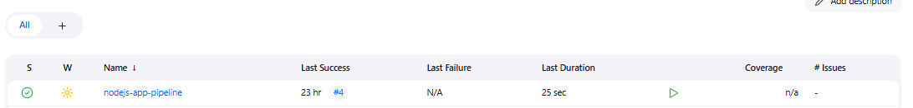

### Practicals 4: Jenkins Server for a git repository

This practical focused on setting up a Jenkins CI/CD pipeline to automate the build, test, and deployment process for a Node.js application. I successfully configured Jenkins on my machine and integrated it with a Git repository containing a Node.js project.

#### Part 1: Guided Exercise
Installed Required Plugins

Inside Manage Jenkins → Manage Plugins, I installed:

1. **NodeJS Plugin** – for managing Node.js environments


2. **Git Plugin** – for Git integration with Jenkins


3. **Pipeline Plugin** – to use pipeline as code via Jenkinsfile


#### Configured Node.js in Jenkins

##### Navigated to Global Tool Configuration
1. Added Node.js installation named NodeJS-20.x
2. Selected automatic installer for Node.js version 20.x


#### Created Pipeline Job

1. Created new Pipeline job in Jenkins



2. Selected "Pipeline script from SCM"


Set Jenkinsfile as the Script Path


##### Configured Git as SCM with repository URL

https://github.com/Eyemusican/-02230307_WEB102_PA1-


#### Created the Jenkinsfile

```
pipeline {
  agent any
  tools {
    nodejs 'NodeJS-20.x'
  }
  stages {
    stage('Install') {
      steps {
        sh 'npm install'
      }
    }
    stage('Test') {
      steps {
        sh 'npm test'
      }
    }
    stage('Build') {
      steps {
        sh 'npm run build'
      }
    }
    stage('Deploy') {
      steps {
        sh 'echo "Deploying to staging..."'
      }
    }
  }
}

```

 I triggered the pipeline manually via Build Now and all stages ran without errors. The Install stage downloaded project files using npm install, the Test stage passed all tests using npm test, the Build stage compiled the app successfully, and the Deploy stage showed the deployment message. The pipeline worked correctly from start to finish.


### Part 2: Challenge - Test Reporting

#### Added JUnit Plugin

1. Installed JUnit Plugin from Manage Plugins
2. Enables test result visualization in Jenkins

#### Enhanced Test Stage
Updated the Jenkinsfile test stage to generate JUnit reports:

```
stage('Test') {
  steps {
    sh 'npm test -- --ci --reporters=jest-junit'
  }
  post {
    always {
      junit 'junit.xml'
    }
  }
}
```
#### Test Report Configuration

I configured Jest to generate JUnit-compatible XML reports by adding the jest-junit reporter to the project's package.json dependencies. This allows Jenkins to parse and display test results directly in its user interface, providing clear visual feedback on which tests passed or failed. 


