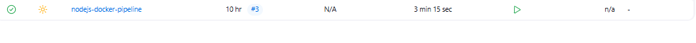
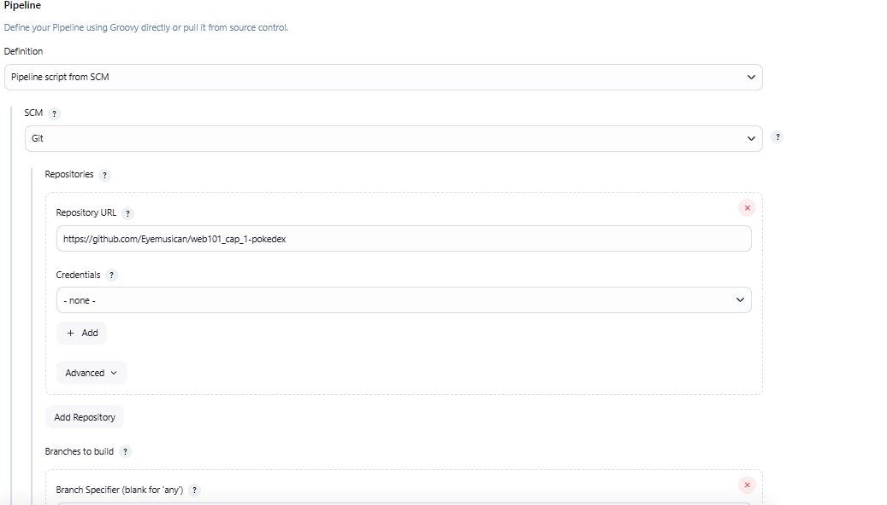
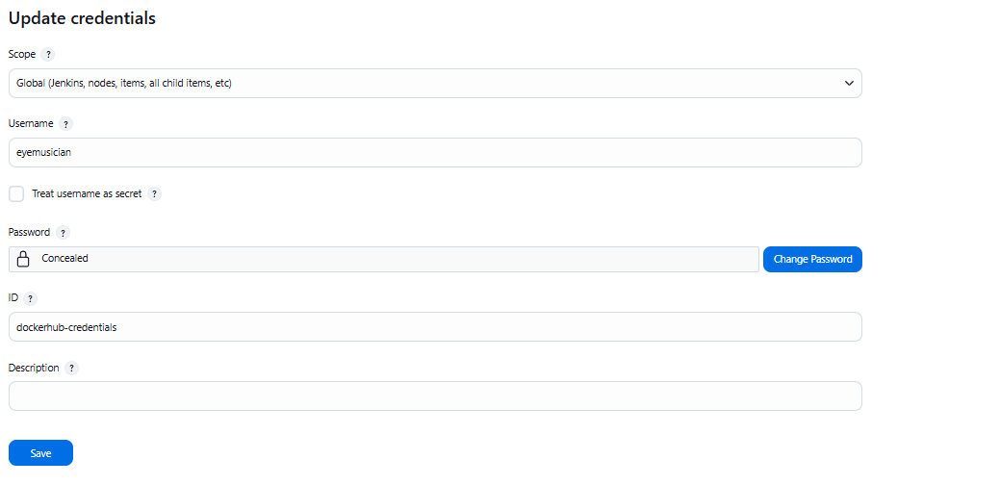
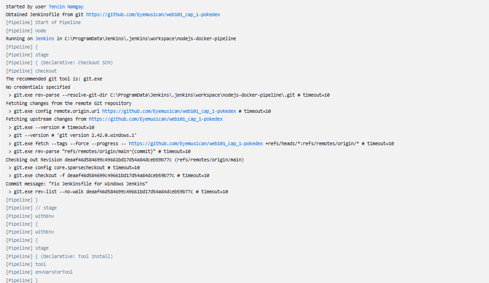
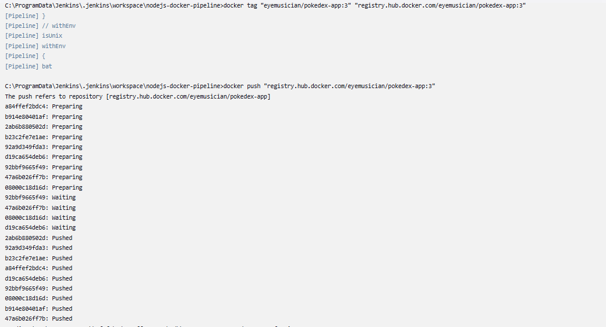

### Practicals 5 & 6: Jenkins Declarative Pipeline with Docker


I completed the Jenkins Declarative Pipeline setup for a Node.js application and integrated it with Docker. The pipeline automatically builds, tests, and pushes Docker images to Docker Hub.

#### Part 1: Guided Exercise
#### Configured Jenkins for Node.js

I installed the NodeJS Plugin and set up Node.js version 20.x in Global Tool Configuration.
```
sames as practical_4

```
#### Created Pipeline Job



Created a new Pipeline job and configured it to use Pipeline script from SCM with my Git repository.



https://github.com/Eyemusican/web101_cap_1-pokedex

#### Created Jenkinsfile
I wrote a declarative pipeline with these stages:

1. Install: Run npm install to get dependencies
2. Build: Run npm run build to compile the app
3. Test: Run npm test to check code quality
4. Deploy: Different commands for main branch vs other branches


```
pipeline {
    agent any
    
    tools {
        nodejs 'NodeJS-20.x'
    }
    
    environment {
        CI = 'true'
        DOCKER_IMAGE = 'eyemusician/pokedex-app'  
        DOCKER_TAG = "${BUILD_NUMBER}"
    }
    
    stages {
        stage('Checkout') {
            steps {
                checkout scm
            }
        }
        
        stage('Install Dependencies') {
            steps {
                bat 'npm install'  
            }
        }
        
        stage('Build') {
            steps {
                bat 'npm run build'  
            }
        }
        
        stage('Test') {
            steps {
                bat 'npm test'  
            }
        }

```

1. **Pipeline setup** : Tells Jenkins to run on any available machine

2. **Tools** : Uses Node.js version 20.x that we configured earlier

3. **Environment**: Sets up variables - Docker image name is eyemusician/pokedex-app and tags it with the build number

4. **Checkout** : Gets code from Git repository

5. **Install** : Downloads all the packages  app needs using npm install

6. **Build**: Compiles Pokedex app with npm run build

7. **Test**: Runs tests to make sure everything works


#### Docker and Deployment Stages

```
stage('Build Docker Image') {
            steps {
                script {
                    docker.build("${DOCKER_IMAGE}:${DOCKER_TAG}")
                    docker.build("${DOCKER_IMAGE}:latest")
                }
            }
        }
        
        stage('Push to Docker Hub') {
            steps {
                script {
                    docker.withRegistry('https://registry.hub.docker.com', 'dockerhub-credentials') {
                        docker.image("${DOCKER_IMAGE}:${DOCKER_TAG}").push()
                        docker.image("${DOCKER_IMAGE}:latest").push()
                    }
                }
            }
        }
        
        stage('Deploy') {
            steps {
                bat 'npm run deploy:prod'  
            }
        }
    }
    
    post {
        always {
            bat 'docker image prune -f'  
        }
    }
}

```

1. **Build Docker Image** : Creates two Docker images of  Pokedex app - one with the build number and one tagged as "latest"

2. **Push to Docker Hub** : Logs into Docker Hub using saved credentials and uploads both images to your repository

3. **Deploy** : Runs production deployment command

4. **Cleanup** : After everything is done, removes old Docker images to save space on the Jenkins server


### Part 2: Challenge - Docker Integration

#### Added Docker to Pipeline

I extended my pipeline to:

1. Build Docker images of my Node.js app
2. Push images to Docker Hub
3. Use Jenkins credentials for secure login

#### Set Up Docker Hub Credentials :

In Jenkins, I added my Docker Hub username and password as credentials for secure access.



#### Enhanced Jenkinsfile

Updated my pipeline to include Docker stages: 

```
stage('Build Docker Image') {
  steps {
    script {
      def dockerImage = docker.build("username/my-app:${BUILD_NUMBER}")
    }
  }
}

stage('Push to Docker Hub') {
  steps {
    script {
      docker.withRegistry('https://registry.hub.docker.com', 'docker-credentials') {
        dockerImage.push()
        dockerImage.push('latest')
      }
    }
  }
}

```




#### Created Dockerfile
I wrote a simple Dockerfile for my Node.js app:

```
FROM node:20-alpine
WORKDIR /app
COPY package*.json ./
RUN npm install
COPY . .
EXPOSE 3000
CMD ["npm", "start"]

```

My Pokedex app Docker image was successfully uploaded to Docker Hub repository registry.hub.docker.com/eyemusician/pokedex-app. This means anyone can now pull and run my containerized application from Docker Hub.




This proves the Docker integration worked perfectly - Jenkins built my app, created a Docker image, and pushed it to the cloud registry automatically


