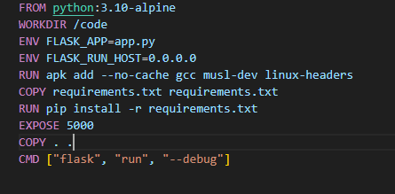
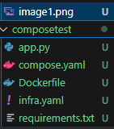
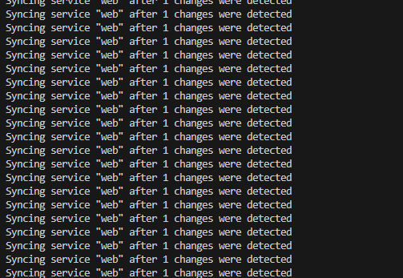

# SS2025_DSO101_02230307

### Docker Compose Lab Report

#### Introduction

This report shows how I built a simple web application using Docker Compose . I created a Python Flask app with Redis that counts page visits. The lab shows how Docker Compose makes it easier to run applications that use multiple containers.

#### Implementation Steps

I created a new folder for the project and made these required files:

##### 1. app.py
##### 2. requirements.txt
##### 3. Dockerfile


#### Flask Application (app.py)

The Flask app creates a web page that counts visitors using Redis to store the count.

#### Project Dependencies (requirements.txt)

##### flask
##### redis

#### Dockerfile




#### Final outcome for step 1 :



---

### Creating the Docker Compose File

I made a compose.yaml file that sets up two services:

1. web
2. Redis

```
services:
  web:
    build: .
    ports:
      - "8000:5000"
  redis:
    image: "redis:alpine"

```

This file tells Docker to make the web app available on port 8000 and use the Redis image from Docker Hub.

### Running the Application

I used docker compose up to start the application:


I checked the app by opening http://localhost:8000 in my browser:


I refreshed the page to see the counter increase:


### Adding Live Code Updates

I updated the compose.yaml file to enable Compose Watch, which lets me change code without restarting containers:

```
include:
   - infra.yaml
services:
  web:
    build: .
    ports:
      - "8000:5000"
    develop:
      watch:
        - action: sync
          path: .
          target: /code

```

### Testing Live Updates

I ran the app with watch mode turned on:


I changed the greeting in app.py from "Hello World!" to "Hello from Docker!" and After refreshing the browser, I saw my changes without needing to restart:


### Splitting the Compose File

I split my setup into two files to make it more organized:

Created infra.yaml for the Redis part:

```
services:
  redis:
    image: "redis:alpine"
```


Updated compose.yaml to include the new file:

```
include:
   - infra.yaml
services:
  web:
    build: .
    ports:
      - "8000:5000"
    develop:
      watch:
        - action: sync
          path: .
          target: /code

```
I made sure the app still worked with the split files:



### Trying Other Docker Compose Commands

I ran the app in background mode:


I checked which services were running:


Finally, I stopped everything:


In this practical, I learned how to use Docker Compose to run a web app with a database. I found it much easier to set up both containers using just one configuration file rather than managing them separately. The lab taught me how to connect different services, update code without restarting containers, and use basic Docker Compose commands. This hands-on experience showed me why Docker Compose is helpful for developers working with applications that use multiple containers.


