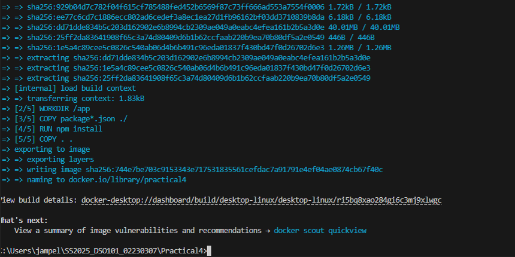
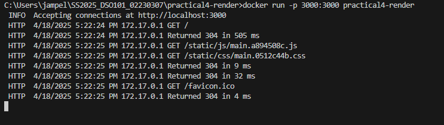

# Practical 4: Docker Deployment
This project demonstrates the deployment of a Docker container to both DockerHub and Render. The practical covers 

1. Creating a Docker image and pushing it to DockerHub
2. Creating a Dockerfile for a web application and deploying it to Render via GitHub

### Part 1: Docker Image Creation and Push to DockerHub
For the first part of the assignment, I created a Docker image using Alpine Linux with Node.js:

#### 1. Built the Docker image locally : 
```
docker build -t practical4:latest .
```


#### 2. Tagged and pushed the image to DockerHub: 
```
1. docker tag practical4:latest eyemusician/practical4:latest

2. docker push eyemusician/practical4:latest
```


### Part 2: Web Application Deployment to Render
For the second part, I created a simple React application and deployed it to Render : 

#### 1. Created a React web app that shows the current time and  environment info  :


#### 2. Used a multi-stage Dockerfile to optimize the build process

#### 3. Set up GitHub Actions to automatically deploy the app to Render

#### 4. Then, Run the Docker container locally:
```
docker run -p 3000:3000 practical4-render
```


#### 5. Finally, I deployed to Render by connecting my GitHub repository to Render's web service

### Deployment Details
1. Local Testing: I ran the app on my computer and it worked at http://localhost:3000

2. Render Deployment: After deploying to Render, the app can be opened using the Render URL

3. Container Setup: Inside the Docker container, the app runs on port 3000


### Local Development

1. Install dependencies:
```
npm install
```

2. To Start the development server:
```
npm start
```


## Technologies Used

- React.js
- Docker
- GitHub Actions
- Render cloud platform
- Alpine Linux

